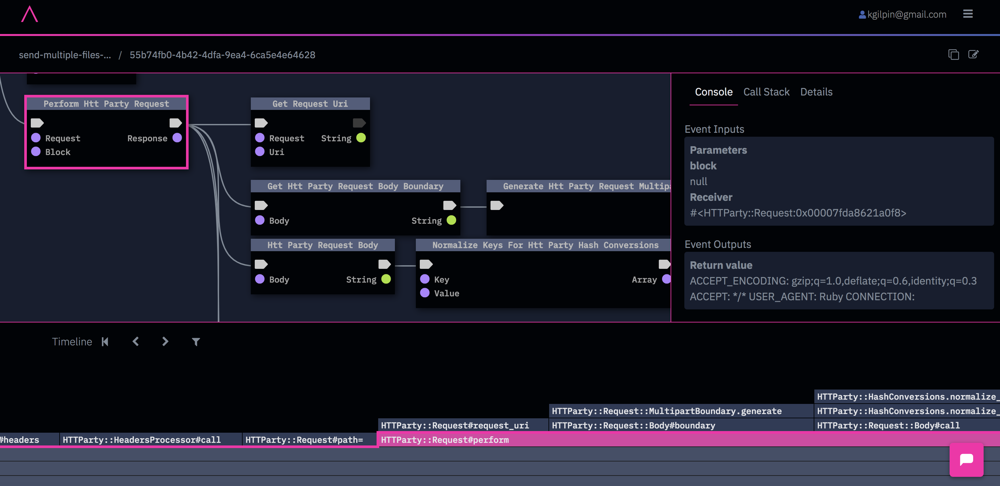

# How to send multiple files using HTTParty?

Demonstration program for Stack Overflow question https://stackoverflow.com/questions/56190082/send-multiple-files-using-httparty

This example program:

* Runs a web server which always responds by echoing the request.
* Computes differences between the requests constructed by `Net::HTTP` and `HTTParty` and prints the differences to the console.

# Usage

```
$ bundle
$ bundle exec ruby main.rb
Configuring AppMap from path appmap.yml
[2020-07-10 16:57:26] INFO  WEBrick 1.4.2
[2020-07-10 16:57:26] INFO  ruby 2.6.2 (2019-03-13) [x86_64-darwin17]
[2020-07-10 16:57:26] INFO  WEBrick::HTTPServer#start: pid=21000 port=9292
::1 - - [10/Jul/2020:16:57:27 EDT] "POST / HTTP/1.1" 200 540
- -> /
::1 - - [10/Jul/2020:16:57:27 EDT] "POST / HTTP/1.1" 200 497
- -> /
 ACCEPT_ENCODING: gzip;q=1.0,deflate;q=0.6,identity;q=0.3
 ACCEPT: */*
 USER_AGENT: Ruby
+CONNECTION: close
 HOST: localhost:9292

---Z4AsGMgBzlQfhvxxbkKjDtTWNopI_PO66hMMzmY2Hok4_7X7iLiWzA
+--------------------------uzT2eCLymlS4aSKx
 Content-Disposition: form-data; name="attachments[]"; filename="file1.txt"
-Content-Type: application/octet-stream
+Content-Type: text/plain

 file1
---Z4AsGMgBzlQfhvxxbkKjDtTWNopI_PO66hMMzmY2Hok4_7X7iLiWzA
+--------------------------uzT2eCLymlS4aSKx
 Content-Disposition: form-data; name="attachments[]"; filename="file2.rb"
-Content-Type: application/octet-stream
+Content-Type: application/x-ruby

 'file2'
---Z4AsGMgBzlQfhvxxbkKjDtTWNopI_PO66hMMzmY2Hok4_7X7iLiWzA--
+--------------------------uzT2eCLymlS4aSKx--
[2020-07-10 16:57:27] INFO  going to shutdown ...
[2020-07-10 16:57:27] INFO  WEBrick::HTTPServer#start done.
```

# Results

From the diff, you can tell that there are a couple of minor differences:

1) HTTParty sends the header `CONNECTION: close`.
2) HTTParty guesses the MIME type of each file.

The other difference indicated in the diff is just the different random content separator strings which are generated by each library.

If your web server is not responding properly to this request, then the problem might be with the MIME type. The `Connection` header controls keep-alive, and the request is valid with or without it; especially since `close` is the default.

See: https://developer.mozilla.org/en-US/docs/Web/HTTP/Headers/Connection

# Behavior of `HTTParty`

Here is the program execution of `HTTParty::Request`:

[](https://app.land/scenarios/71cb4798-b251-4918-b729-fc00b64538bd#event=13).


